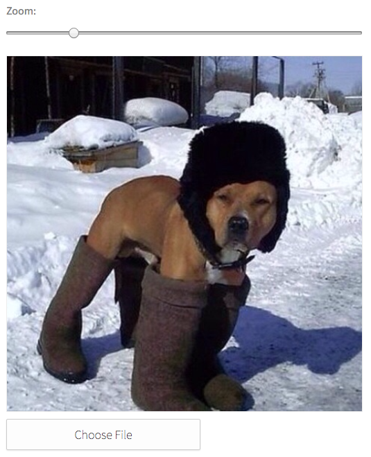

# Image Uploader

Open an image, scale and crop, and then upload.



```jsx
import ImageUploader from 'patchkit-image-uploader'
<ImageUploader ref="myImageInput" current="/img/pic1.jpg" onChange={onChange} />
```

When ready to read the image data (eg for uploading), use the `canvasToPng` function:

```js
const canvas = this.refs.myImageInput.querySelector('canvas')
ImageInput.canvasToPng(canvas, function (err, buffer) {
  if (err) return cb(err)
  // buffer now contains png data
  // can do eg buffer.toString('base64')
})
```

Use the .less file:

```less
@import "node_modules/patchkit-image-uploader/styles.less"
```